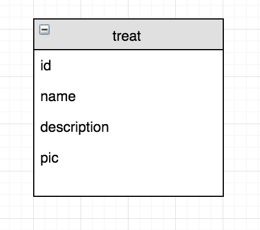

# Code Challenge - Week 4 (SQL Databases)

## Overview

Provide students with HTML and JavaScript. JavaScript will include AJAX calls to a CRUD-capable server (students will create server and database code). 

Add the following routes. Do them in the suggested order below.

#### Base Mode

* `GET /treats` returns a list of potential treats (e.g. cupcakes, goldfish, etc) and their image URLs.
* `POST /treats` expects a treat description and link to a url image.

#### Hard Mode
GET requests can pass some data to the server as part of the URL (ex. see below ```/treats?q=donut```. This stack overflow link was useful to see where the this data is stored on the express request object: [GET parameters after q](http://stackoverflow.com/questions/17007997/how-to-access-the-get-parameters-after-in-express).

* `GET /treats?q=donut` should return only treats that match the query parameter

## TODO

1. Fork and clone this repository.
2. Take some time to look at the given code. What code is needed and what will be removed once the server side code is generated?
3. Design and create the database. Be sure to commit the create table syntax in the ```create_database.sql``` file.
4. Build out the server routes described above.
5. Remove HTML that will be generated via AJAX calls once server-side has been tested.

## Entity Relational Diagram
